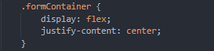
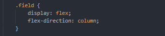
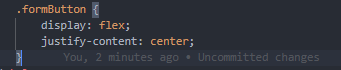
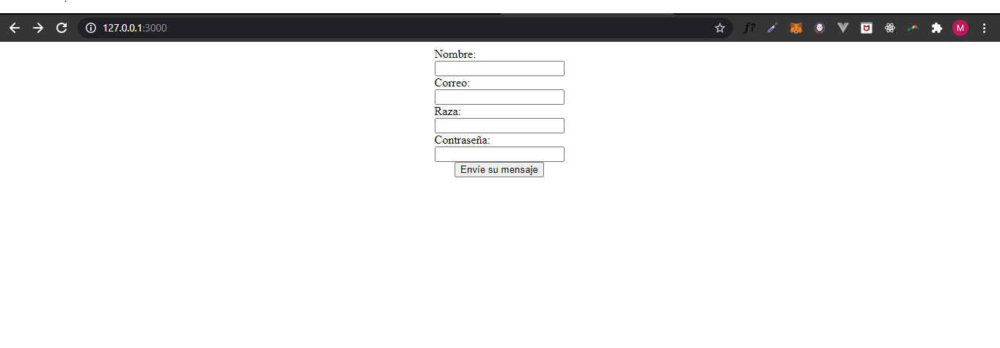

# Ejemplo integrador

En esta guía vamos a realizar un ejemplo integrador de lo presentado hasta ahora, haciendo hincapié en:

- Calidad del código.

- Presentar una posible estructura de carpetas.

- Presentar webpack.

- Seguir el modelo Flexbox.

## Estructura de carpetas:

Algo importante a la hora de comenzar proyectos de software para que sean mantenibles y que tengan una fácil adaptación para nuevos desarrolladores es definir una correcta estructura de carpetas.

A la hora de pensar en una estructura de carpetas es importante tener en cuenta los siguientes conceptos que se mapean a archivos:

- Pantallas de mi aplicación. Ej: home.html y su javascript asociado.

- Interacción con el backend. Ej: HttpService.js

- Assets. EJ: logo.png

- Manejo de estados de mi aplicación. Ej: Store.js

- Componentes de reutilizables. Ej: Button.js

- Helpers de lógica de negocio de la aplicación. EJ: HomeDashboardHelpers.js

- Navegación de mi aplicación. Ej: Navigation.js

- Entre otros, depende fuertemente de que tecnología estemos utilizando y cómo manejemos el estado en nuestra aplicación.

Una estructura que podría adaptarse a los puntos comentados arriba sería la siguiente:

- .vscode

- node_modules

- src

  - scenes

    - signUp

    - home

    - etc

  - state

    - store

    - entities

      - Pet.js

      - etc

  - components

    - button

      - button.js

  - common

    - helpers

  - navigation

    - Routes.js

    - Navigation.js

- assets

  - images

  - icons

  - fonts

- …

.vscode y node_modules son carpetas autogeneradas, la primera cuando realizamos configuraciones a nivel de workspace del proyecto y la segunda cuando instalamos dependencia de npm en el proyecto.

En nuestro caso dado que vamos a realizar un ejemplo más sencillo vamos a ignorar lo que comentamos aquí.

## Webpack:

Webpack es un module bundler, o dicho de otra forma, una librería que nos permite gestionar todos los recursos necesarios para correr nuestra aplicación mediante el uso de sintaxis ES6 dentro de nuestro código fuente en Javascript. Nos permite cosas como importar un archivo CSS desde el JS de un componente y automáticamente añadirlo al bundle final.

Por más información sobre webpack se puede consultar los siguientes links:

[https://webpack.js.org/concepts/](https://webpack.js.org/concepts/)

[https://survivejs.com/webpack/what-is-webpack/](https://survivejs.com/webpack/what-is-webpack/)

También recomendamos como guía de inicio la siguiente guía de webpack que explica paso a paso la creación de un proyecto en webpack.

[https://webpack.js.org/guides/installation/](https://webpack.js.org/guides/installation/)

Este proyecto será incluido en la carpeta webpack-example.

## Diseño de interfaz

### Bosquejo

Como hemos comentado en la guía de flexbox es útil realizar un bosquejo sobre lo que queremos modelar en papel o en alguna herramienta.

En nuestro caso no tenemos un diseño a nuestra disposición y dado que lo que vamos a hacer es simple (algunos inputs y un botón) no vamos a realizar un bosquejo.

### Implementación Html

Hemos creado un html muy sencillo que utiliza divs y un form siguiendo el ejemplo de la siguiente guía:

[https://developer.mozilla.org/es/docs/Learn/HTML/Forms/Your_first_HTML_form](https://developer.mozilla.org/es/docs/Learn/HTML/Forms/Your_first_HTML_form)

### Implementación con flexbox

Lo que vamos a buscar es:

1. Centrar horizontalmente el formulario
   

2. Centrar el botón de enviar centrado horizontalmente.
   

3. Los inputs con su correspondiente label estén uno debajo del otro.
   

El resultado es el siguiente:

##

Implementación de la lógica:

La única funcionalidad que tendrá esta pantalla es la posibilidad de llenar los datos del formulario y enviarlo a una función que validará que no falte nada, en caso de ocurrir un fallo retornará un error y node se encargará de este.

La función que valida que el Pet sea válido es la siguiente:

    module.exports = function createPet(_petInfo_) {

    const response = {

        hasAnError: false

    }

    if (*petInfo*.pet_name === '' || *petInfo*.pet_email === '' ||

        *petInfo*.pet_breed === '' || *petInfo*.pet_password === '') {

        response.hasAnError = true;

    } else {

        *//... Register the pet in database*

    }

    return response

    }

Luego desde el index.js donde creamos el server de node estamos chequeando en cada petición al server si es de tipo post (dado que el formulario al realizar submit hace un post).

    if (req.method === 'POST') {

Si es de tipo post, obtenemos la data de la request primero:

        req.on('data', function (*data*) {

            body += *data*;

            *// Too much POST data, kill the connection!*

            *// 1e6 === 1 * Math.pow(10, 6) === 1 * 1000000 ~~~ 1MB*

            if (body.length > 1e6)

                req.connection.destroy();

        });

Y luego utilizando la librería querystring parseamos el body y obtenemos los datos de la request:

        req.on('end', function () {

            let petInfo = queryString.parse(body);

            const response = createPet(petInfo);

            if (response.hasAnError) {

                res.writeHead(500, {

                    "Content-Type": "text/plain"

                });

                res.end("Error trying to create a pet");

            } else {

                res.writeHead(200, {

                    "Content-Type": "text/plain"

                });

                res.end("Success");

            }

        });

Como se puede ver, en el caso de que la response de createPet devuelva un error se muestra un error en el html, en caso contrario se muestra un mensaje de Success.

## Conclusión:

- Al comienzo de un proyecto es importante definir y entender bien el rol de cada carpeta/archivo.

- Webpack es una herramienta importante que será necesaria ser utilizada a medida que la base de código va creciendo.
  Se ha presentado un ejemplo muy básico pero que agregando distintos loaders (dado que webpack se centraliza en javascript es necesario agregar loaders para html, css, assets, etc) se puede tomar agregar mucho poder a esta herramienta.

- Flexbox es un modelo útil a la hora de desarrollar interfaces.

- Es fundamental acostumbrarnos a planificar lo que vamos a hacer a la hora de intentar diseñar una pantalla.
  Un comienzo desprolijo muy probablemente genere un resultado del mismo índole, poniendo en riesgo su mantenibilidad a futuro y posiblemente provocando bugs en distintas resoluciones.
